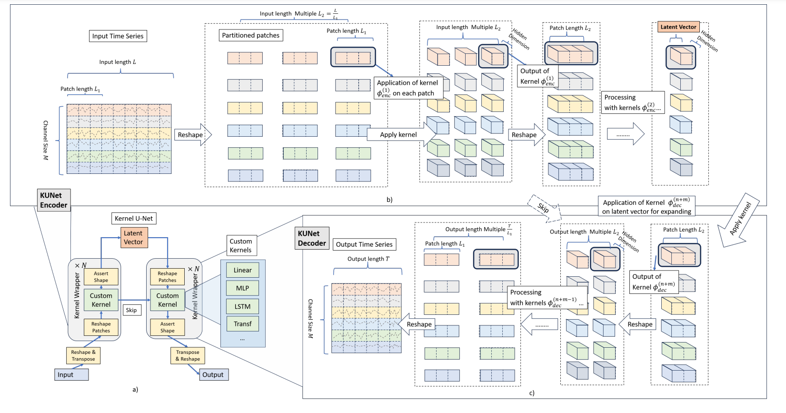
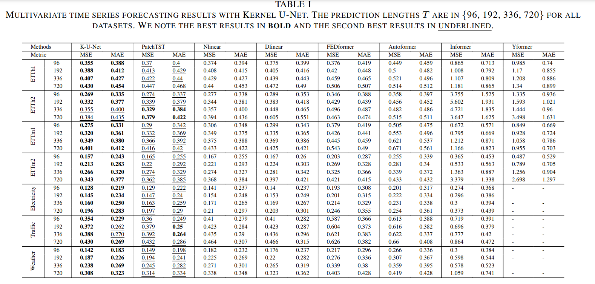

# (INISTA 24) Kernel-U-Net: Multivariate Time Series Forecasting using Custom Kernels


This Official repository contains PyTorch codes for Kernel-U-Net: Multivariate Time Series Forecasting using Custom Kernels
 [paper](https://arxiv.org/abs/2401.01479).


## Abstract 
Time series forecasting task predicts future trends based on historical information. Transformer-based U-Net architectures, despite their success in medical image segmentation, have limitations in both expressiveness and computation efficiency in time series forecasting as evidenced in YFormer. To tackle these challenges, we introduce Kernel-U-Net, a flexible and kernel-customizable U-shape neural network architecture. The kernel-U-Net encoder compresses the input series into latent vectors, and its symmetric decoder subsequently expands these vectors into output series. Specifically, Kernel-U-Net separates the procedure of partitioning input time series into patches from kernel manipulation, thereby providing the convenience of customized executing kernels. Our method offers two primary advantages: 1) Flexibility in kernel customization to adapt to specific datasets; and 2) Enhanced computational efficiency, with the complexity of the Transformer layer reduced to linear. Experiments on seven real-world datasets, demonstrate that Kernel-U-Net's performance either exceeds or meets that of the existing state-of-the-art model in the majority of cases in channel-independent settings. The source code for Kernel-U-Net will be made publicly available for further research and application.

## Kernel-U-Net
> 🌟 If you find this resource useful, consider adding a star to this repository and citing our research:

```tex
@inproceedings{10683862,
  author={You, Jiang and Cela, Arben and Natowicz, René and Ouanounou, Jacob and Siarry, Patrick},
  booktitle={2024 International Conference on INnovations in Intelligent SysTems and Applications (INISTA)}, 
  title={Kernel-U-Net: Multivariate Time Series Forecasting using Custom Kernels}, 
  year={2024},
  volume={},
  number={},
  pages={1-8},
  keywords={Time series Forecasting;Architecture;U-Net;Transformers;},
  doi={10.1109/INISTA62901.2024.10683862}}
```
In case of any questions, bugs, suggestions or improvements, please feel free to open an issue.

## Designs

**Separate patch operations**: Separate patch partitions and kernel operations allow fast meta-operations on patches and easy kernel customization.

**Kernel Customization**: Flexible kernel customization for rapid development and testing



## Main Results




## Get Started

1. Dataset can be obtained from Time Series Library (TSlib) at <https://github.com/thuml/Time-Series-Library/tree/main> 

2. Run the python script for example

```
from kunlib import KUNet, Linear, LSTM, Transformer
import torch

kun = KUNet(input_dim=128, input_len=8, 
                 n_width=[1], n_height=[8, 8], 
                 latent_dim=128, latent_len=1, 
                 output_dim=128, output_len=8, 
                 hidden_dim=[128]*3, 
                 kernel=[Linear, LSTM, Transformer], kernel_hidden_layer=[1, 1, 1],
                 verbose=False, params={"unet_skip":True, 
                         "unet_skip_concat":True,

                         "inverse_norm":False,
                         "mean_norm":False,
                         "chanel_independent":False,
                         "residual":False, })

print(kun)

x = kun(torch.rand((13,512,128)))
print(x.shape)

```


## Contact

If you have any questions or concerns, please contact us: [Kernel-U-Net@github.com]


