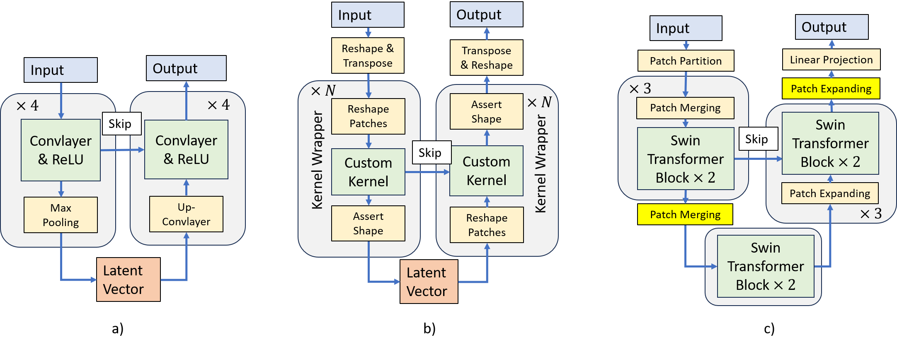

# (arXiv'24) Kernel-U-Net: Symmetric and Hierarchical Architecture for Multivariate Time Series Forecasting

This Official repository contains PyTorch codes for Kernel-U-Net: Symmetric and Hierarchical Architecture for Multivariate Time Series Forecasting [paper](https://arxiv.org/abs/2401.01479).

## Kernel-U-Net
> 🌟 If you find this resource useful, consider adding a star to this repository and citing our research:

```tex
@inproceedings{you2024kun,
  title={Kernel-U-Net: Symmetric and Hierarchical Architecture for Multivariate Time Series Forecasting},
  author={Jiang, You and René, Natowicz and Arben, Cela and Jacob, Ouanounou and Patrick, Siarry},
  booktitle={Arxiv},
  year={2024}
}
```
In case of any questions, bugs, suggestions or improvements, please feel free to open an issue.

## Designs

**Separate Patch Operations**: Separate patch operations and kernel operations allow for fast meta-operations on patches and easy kernel customization.

**Kernel Customization**: Flexibility of kernel customization to fit specific data sets



## Main Results


## Get Started

1. Dataset can be obtained from Time Series Library (TSlib) at <https://github.com/thuml/Time-Series-Library/tree/main> 

2. Run the bash script for experiments

```
cd kun
bash scripts/script_ETTh2.sh
```


## Contact

If you have any questions or concerns, please contact us: [Kernel-U-Net@github.com]

